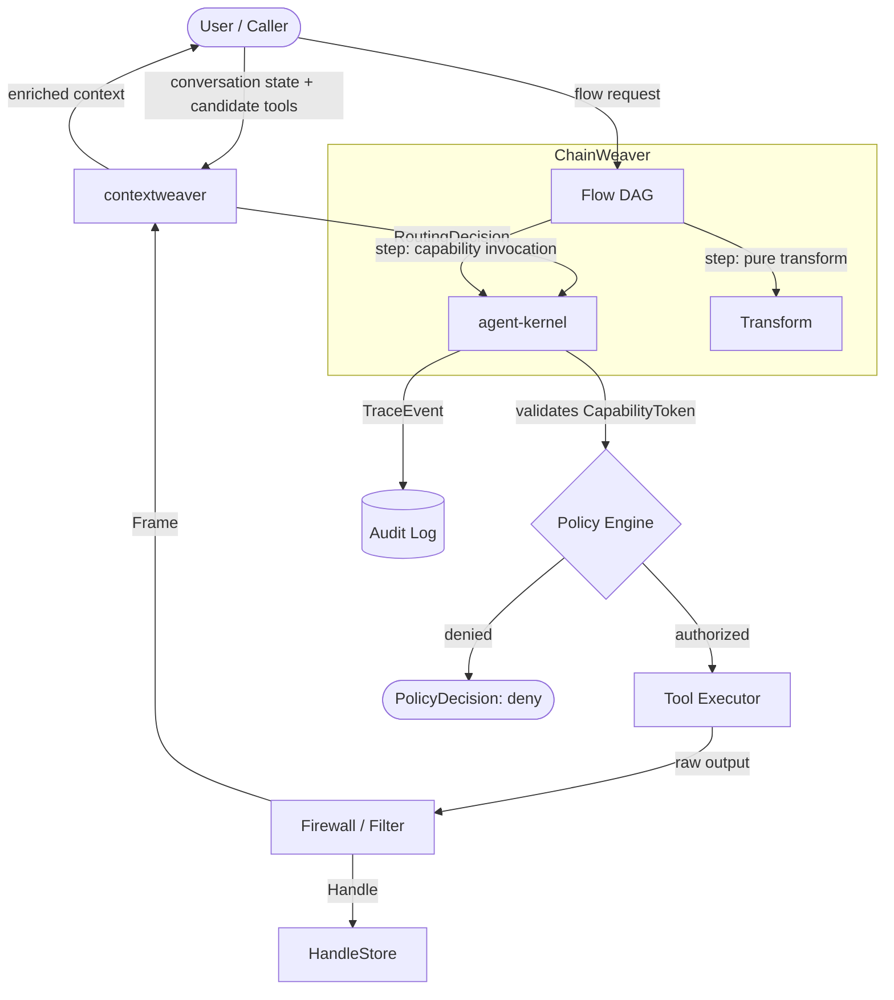

# Architecture

## The Three Layers

The Weaver stack is divided into three independent layers. Each layer has a single, clear responsibility. They communicate through the contracts defined in this repository.

| Layer | Repository | Responsibility |
| ------- | ----------- | ---------------- |
| **Routing** | contextweaver | Compiles context, selects tools as ChoiceCards, produces a RoutingDecision |
| **Execution** | agent-kernel | Authorizes capabilities, executes tools, firewalls raw output, produces Frames + Handles |
| **Orchestration** | ChainWeaver | Executes deterministic DAG flows; may expose flow steps as capability types |

### Layer Descriptions

#### contextweaver (Routing Layer)

Receives the current conversation state and a set of candidate tools. Compiles a concise context window and selects a bounded number of tools as `ChoiceCard` objects. Returns a `RoutingDecision`. It never calls tools directly and never sees raw tool output.

#### agent-kernel (Execution Layer)

Receives a `RoutingDecision` and a `CapabilityToken`. Validates the token, authorizes the capability, executes the tool, and applies the firewall. The firewall transforms raw tool output into a `Frame` (safe summary) and optionally a `Handle` (opaque reference to the raw artifact). Only Frames and Handles leave the kernel.

#### ChainWeaver (Orchestration Layer)

Executes multi-step flows defined as directed acyclic graphs. Each step can be a capability invocation (delegated to agent-kernel) or a pure transformation. ChainWeaver is optional; the stack is fully functional with just contextweaver + agent-kernel for single-step tool use.

---

## Architecture Diagram

---

## Data Flow Summary

1. The caller sends a request with conversation state.
2. **contextweaver** compiles a bounded context and returns a `RoutingDecision` containing one or more `ChoiceCard` objects.
3. The selected `ChoiceCard` (plus a `CapabilityToken`) is sent to **agent-kernel**.
4. **agent-kernel** validates the token against its policy engine (`PolicyDecision`).
5. If authorized, the tool is executed; raw output is passed through the firewall.
6. The firewall produces a `Frame` (safe view) and optionally stores the raw artifact as a `Handle`.
7. The `Frame` is returned to contextweaver or the caller. The raw artifact is never exposed by default.
8. All execution events are recorded as `TraceEvent` entries in the audit log.
9. **ChainWeaver** (when present) orchestrates multiple such cycles as a DAG, treating each step as either a capability invocation or a pure transformation.

---

## Composable Adoption

The stack is designed for incremental adoption:

- **contextweaver alone**: You get smart tool routing without any execution kernel. You provide your own execution layer.
- **agent-kernel alone**: You get safe, auditable execution without contextweaver's routing. You provide your own routing layer.
- **ChainWeaver alone**: You get deterministic flow execution with any tool execution backend.
- **Any combination**: The contracts defined here ensure that the pieces fit together without modification.

See [ADOPTION_GUIDE.md](ADOPTION_GUIDE.md) for detailed guidance.
