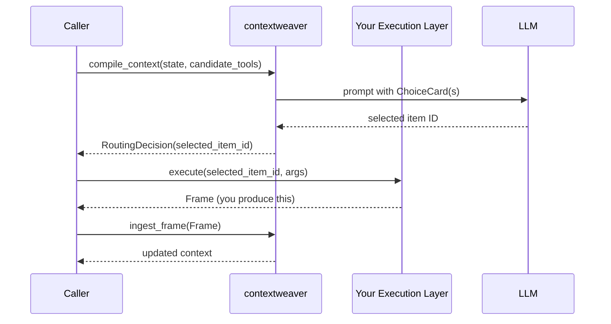
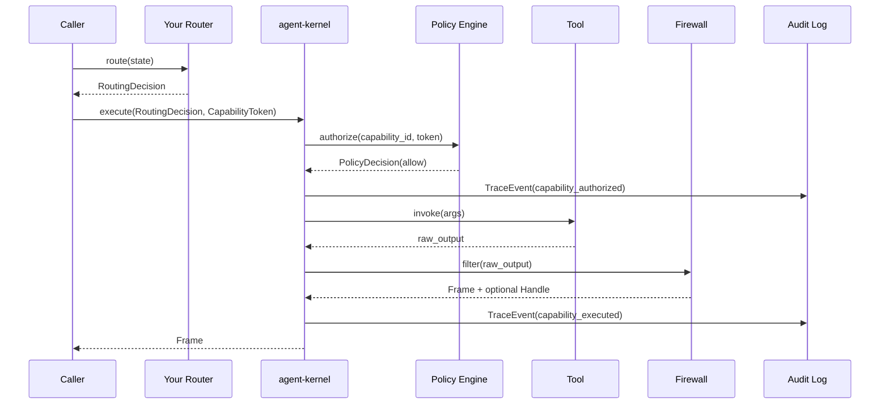
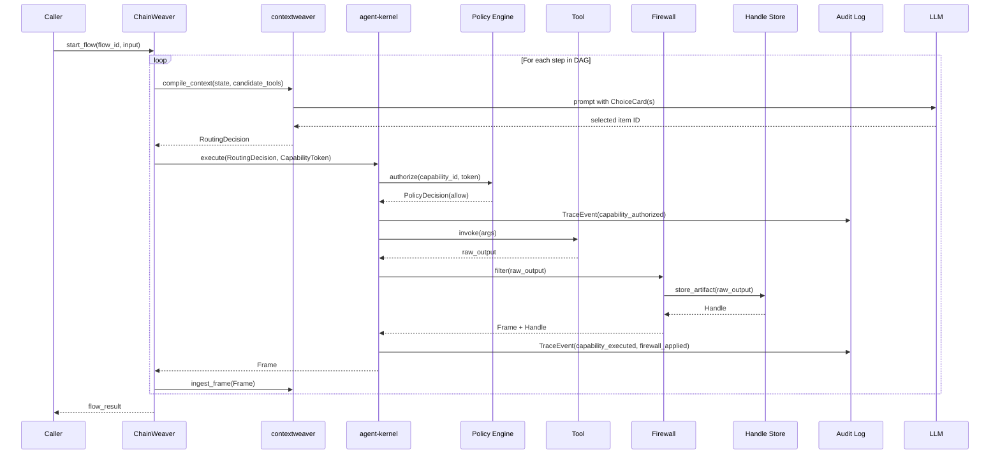

# Sequence Diagrams

Mermaid sequence diagrams for the three primary adoption modes. See [ADOPTION_GUIDE.md](ADOPTION_GUIDE.md) for context on when to use each mode.

---

## 1. contextweaver-Only Routing (No Kernel)

Used when you want smart tool routing but provide your own execution layer.

**What you own:** Your execution layer must produce a `Frame`. The Frame contract is defined in this spec. contextweaver will not accept raw tool output.

---

## 2. Kernel-Only Execution (External Router)

Used when you want safe, auditable execution but provide your own routing layer.

**What you own:** Your router must produce a `RoutingDecision`. The RoutingDecision contract is defined in this spec.

---

## 3. Full Stack (contextweaver → agent-kernel → ChainWeaver Flow)

Used when you want the complete ecosystem for complex, multi-step agentic workflows.

**Key observations:**

- Raw output never leaves agent-kernel; only `Frame` and `Handle` references are returned.
- Each step is independently authorized via a `CapabilityToken`.
- contextweaver never interacts with agent-kernel directly; ChainWeaver mediates.
- The audit log receives a `TraceEvent` for every authorization and execution.
