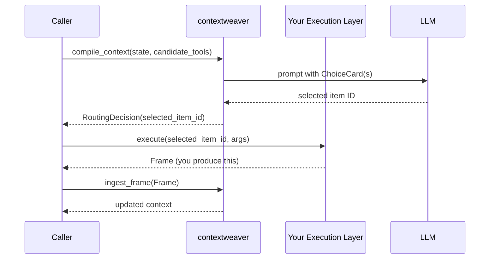
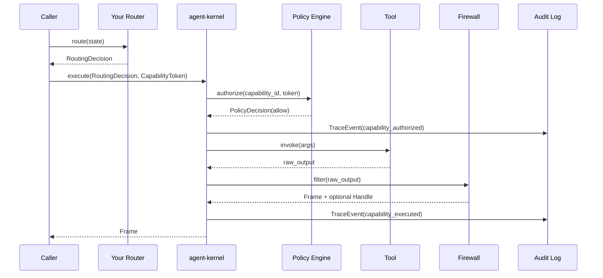
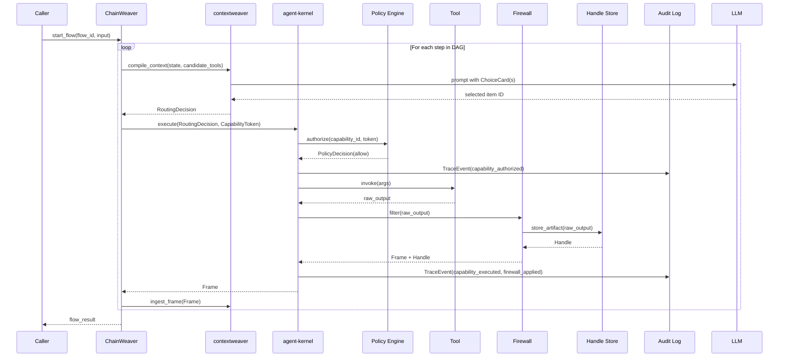
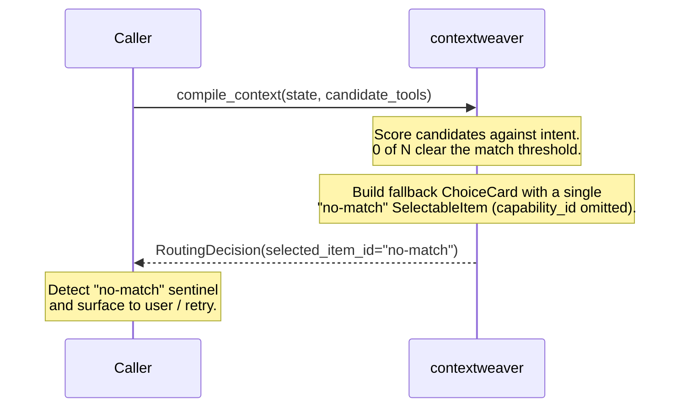
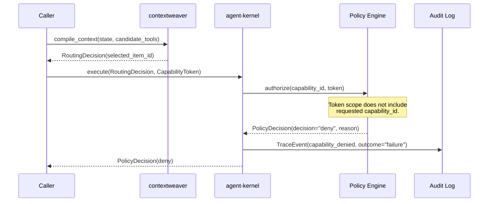
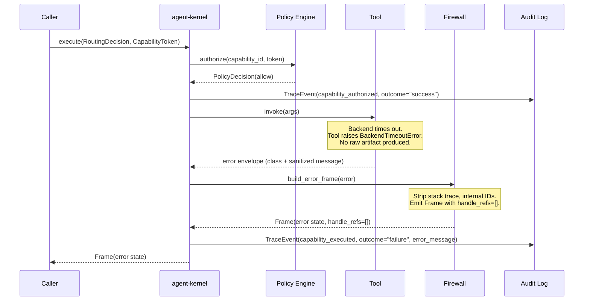

# Sequence Diagrams

Mermaid sequence diagrams for the three primary adoption modes. See [ADOPTION_GUIDE.md](ADOPTION_GUIDE.md) for context on when to use each mode. For the end-to-end cross-repo "golden path" (routing → execution → gating → audit → learning loop) and its per-step contract dependencies, see [GOLDEN_PATH.md](GOLDEN_PATH.md).

---

## 1. contextweaver-Only Routing (No Kernel)

Used when you want smart tool routing but provide your own execution layer.

```mermaid
sequenceDiagram
    participant Caller
    participant contextweaver
    participant YourExecutor as Your Execution Layer
    participant LLM

    Caller->>contextweaver: compile_context(state, candidate_tools)
    contextweaver->>LLM: prompt with ChoiceCard(s)
    LLM-->>contextweaver: selected item ID
    contextweaver-->>Caller: RoutingDecision(selected_item_id)

    Caller->>YourExecutor: execute(selected_item_id, args)
    YourExecutor-->>Caller: Frame (you produce this)
    Caller->>contextweaver: ingest_frame(Frame)
    contextweaver-->>Caller: updated context
```

**What you own:** Your execution layer must produce a `Frame`. The Frame contract is defined in this spec. contextweaver will not accept raw tool output.

---

## 2. Kernel-Only Execution (External Router)

Used when you want safe, auditable execution but provide your own routing layer.

```mermaid
sequenceDiagram
    participant Caller
    participant YourRouter as Your Router
    participant AgentKernel as agent-kernel
    participant PolicyEngine as Policy Engine
    participant Tool
    participant Firewall
    participant AuditLog as Audit Log

    Caller->>YourRouter: route(state)
    YourRouter-->>Caller: RoutingDecision

    Caller->>AgentKernel: execute(RoutingDecision, CapabilityToken)
    AgentKernel->>PolicyEngine: authorize(capability_id, token)
    PolicyEngine-->>AgentKernel: PolicyDecision(allow)
    AgentKernel->>AuditLog: TraceEvent(capability_authorized)

    AgentKernel->>Tool: invoke(args)
    Tool-->>AgentKernel: raw_output

    AgentKernel->>Firewall: filter(raw_output)
    Firewall-->>AgentKernel: Frame + optional Handle
    AgentKernel->>AuditLog: TraceEvent(capability_executed)

    AgentKernel-->>Caller: Frame
```

**What you own:** Your router must produce a `RoutingDecision`. The RoutingDecision contract is defined in this spec.

---

## 3. Full Stack (contextweaver → agent-kernel → ChainWeaver Flow)

Used when you want the complete ecosystem for complex, multi-step agentic workflows.

```mermaid
sequenceDiagram
    participant Caller
    participant ChainWeaver
    participant contextweaver
    participant AgentKernel as agent-kernel
    participant PolicyEngine as Policy Engine
    participant Tool
    participant Firewall
    participant HandleStore as Handle Store
    participant AuditLog as Audit Log
    participant LLM

    Caller->>ChainWeaver: start_flow(flow_id, input)

    loop For each step in DAG
        ChainWeaver->>contextweaver: compile_context(state, candidate_tools)
        contextweaver->>LLM: prompt with ChoiceCard(s)
        LLM-->>contextweaver: selected item ID
        contextweaver-->>ChainWeaver: RoutingDecision

        ChainWeaver->>AgentKernel: execute(RoutingDecision, CapabilityToken)
        AgentKernel->>PolicyEngine: authorize(capability_id, token)
        PolicyEngine-->>AgentKernel: PolicyDecision(allow)
        AgentKernel->>AuditLog: TraceEvent(capability_authorized)

        AgentKernel->>Tool: invoke(args)
        Tool-->>AgentKernel: raw_output

        AgentKernel->>Firewall: filter(raw_output)
        Firewall->>HandleStore: store_artifact(raw_output)
        HandleStore-->>Firewall: Handle
        Firewall-->>AgentKernel: Frame + Handle
        AgentKernel->>AuditLog: TraceEvent(capability_executed, firewall_applied)

        AgentKernel-->>ChainWeaver: Frame
        ChainWeaver->>contextweaver: ingest_frame(Frame)
    end

    ChainWeaver-->>Caller: flow_result
```

**Key observations:**

- Raw output never leaves agent-kernel; only `Frame` and `Handle` references are returned.
- Each step is independently authorized via a `CapabilityToken`.
- contextweaver never interacts with agent-kernel directly; ChainWeaver mediates.
- The audit log receives a `TraceEvent` for every authorization and execution.

---

## 4. Routing Failure (No Matching Capabilities)

Used when contextweaver cannot find any registered capability above the match threshold. The full narrative walkthrough is [`examples/failure_scenarios.md`](../examples/failure_scenarios.md) — scenario 1.

```mermaid
sequenceDiagram
    participant Caller
    participant contextweaver

    Caller->>contextweaver: compile_context(state, candidate_tools)
    Note over contextweaver: Score candidates against intent.<br/>0 of N clear the match threshold.
    Note over contextweaver: Build fallback ChoiceCard with a single<br/>"no-match" SelectableItem (capability_id omitted).
    contextweaver-->>Caller: RoutingDecision(selected_item_id="no-match")

    Note over Caller: Detect "no-match" sentinel<br/>and surface to user / retry.
```

**Key observations:**

- agent-kernel is **not** invoked: no `PolicyDecision`, no `TraceEvent`, no execution side effects.
- The schema still requires `choice_cards.minItems: 1` and `items.minItems: 1` — contextweaver satisfies it with a fallback `SelectableItem` whose `capability_id` is omitted, so the caller can detect "no match" without inventing a new contract field.
- `context_summary` carries the diagnostic ("0 of N capabilities above threshold") for audit and follow-up routing.

---

## 5. Authorization Denial (CapabilityToken Rejected)

Used when routing succeeds but the policy engine refuses to authorize the requested capability — for example, the `CapabilityToken` scope does not include the selected capability, or the token has expired. The full narrative walkthrough is [`examples/failure_scenarios.md`](../examples/failure_scenarios.md) — scenario 2.

```mermaid
sequenceDiagram
    participant Caller
    participant contextweaver
    participant AgentKernel as agent-kernel
    participant PolicyEngine as Policy Engine
    participant AuditLog as Audit Log

    Caller->>contextweaver: compile_context(state, candidate_tools)
    contextweaver-->>Caller: RoutingDecision(selected_item_id)

    Caller->>AgentKernel: execute(RoutingDecision, CapabilityToken)
    AgentKernel->>PolicyEngine: authorize(capability_id, token)
    Note over PolicyEngine: Token scope does not include<br/>requested capability_id.
    PolicyEngine-->>AgentKernel: PolicyDecision(decision="deny", reason)
    AgentKernel->>AuditLog: TraceEvent(capability_denied, outcome="failure")

    AgentKernel-->>Caller: PolicyDecision(deny)
```

**Key observations:**

- No `Tool.invoke` call is made; no `Frame` and no `Handle` are produced.
- `PolicyDecision` crosses from agent-kernel to the caller for diagnostics (per the `docs/BOUNDARIES.md` artifact ownership table).
- The `TraceEvent.decision_id` matches `PolicyDecision.decision_id`, making the denial fully attributable in audit.
- This path is the canonical enforcement point for invariants I-02 (every execution authorized + auditable) and I-06 (`CapabilityToken`s are scoped).

---

## 6. Partial Execution Failure (Tool Errors Mid-Stream)

Used when authorization succeeds and the tool starts executing but errors before producing a usable artifact (timeout, network failure, unhandled exception in the tool implementation). The firewall still produces a `Frame` so the caller has an LLM-safe record of the failure. The full narrative walkthrough is [`examples/failure_scenarios.md`](../examples/failure_scenarios.md) — scenario 3.

```mermaid
sequenceDiagram
    participant Caller
    participant AgentKernel as agent-kernel
    participant PolicyEngine as Policy Engine
    participant Tool
    participant Firewall
    participant AuditLog as Audit Log

    Caller->>AgentKernel: execute(RoutingDecision, CapabilityToken)
    AgentKernel->>PolicyEngine: authorize(capability_id, token)
    PolicyEngine-->>AgentKernel: PolicyDecision(allow)
    AgentKernel->>AuditLog: TraceEvent(capability_authorized, outcome="success")

    AgentKernel->>Tool: invoke(args)
    Note over Tool: Backend times out.<br/>Tool raises BackendTimeoutError.<br/>No raw artifact produced.
    Tool-->>AgentKernel: error envelope (class + sanitized message)

    AgentKernel->>Firewall: build_error_frame(error)
    Note over Firewall: Strip stack trace, internal IDs.<br/>Emit Frame with handle_refs=[].
    Firewall-->>AgentKernel: Frame(error state, handle_refs=[])
    AgentKernel->>AuditLog: TraceEvent(capability_executed, outcome="failure", error_message)

    AgentKernel-->>Caller: Frame(error state)
```

**Key observations:**

- Even on failure, the contract guarantees a `Frame` for caller consumption — there is no "raw error" escape hatch (invariant I-01 still applies).
- `handle_refs` is empty because no artifact was produced. `HandleStore` is **not** involved in this scenario.
- The firewall is responsible for redacting backend internals (stack traces, hostnames, internal request IDs) before they reach `structured_data`.
- The success and failure `TraceEvent`s share `decision_id`, so the audit log records "this capability was authorized then executed with failure" as a coherent pair.
