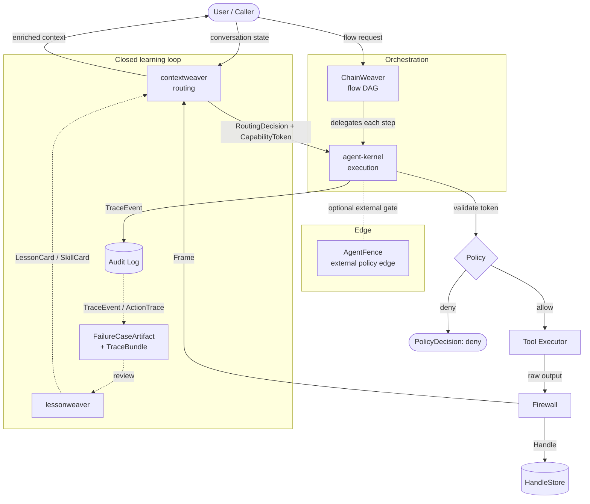

# What Is the Weaver Stack?

The Weaver Stack is a set of independently adoptable repositories that together
describe a **governed, context-budgeted, auditable agent runtime** — and a
**closed learning loop** that lets that runtime improve from its own traces.
This page is the ecosystem-level explainer: why the pieces exist together and
what becomes possible when they do.

> [!NOTE]
> This page is **informative**. It is a narrative entry point, not a
> specification. The canonical authorities remain
> [`docs/INVARIANTS.md`](INVARIANTS.md), [`docs/BOUNDARIES.md`](BOUNDARIES.md),
> and [`docs/ARCHITECTURE.md`](ARCHITECTURE.md); where this page and a canonical
> doc differ, the canonical doc wins. Authority order:
> `INVARIANTS.md > BOUNDARIES.md > ARCHITECTURE.md > everything else`.
>
> **Maturity.** The Weaver Stack is an early, single-author project. The
> credible part today is the **architecture and the contracts** — the shared
> shapes and invariants in this repository — not production hardening or
> adoption numbers. This page leads with the design on purpose.

---

## The problem

Modern LLM-based agents hit four compounding problems (see
[`docs/VISION.md`](VISION.md) for the longer form):

1. **Tool explosion** — injecting 1000+ tool schemas into every prompt is
   expensive and noisy.
2. **Context bloat** — raw tool outputs are large, sometimes sensitive, and
   unsafe to pass to an LLM unfiltered.
3. **Unsafe execution** — without a principled authorization layer, an agent can
   call any tool with any arguments, with no auditable record.
4. **Flaky orchestration** — ad-hoc chaining produces non-deterministic,
   hard-to-debug pipelines.

Each problem has been solved in isolation many times. The gap the Weaver Stack
addresses is solving them **with one shared contract set**, so the pieces compose
instead of each re-inventing the boundary.

---

## The layered architecture

The stack is three runtime layers on the request path, plus adjacent tools that
share the same contracts. Each layer owns a single responsibility and
communicates only through the contracts defined in this repository.

| Layer | Repository | Responsibility |
| ----- | ---------- | -------------- |
| **Routing** | [contextweaver](https://github.com/dgenio/contextweaver) | Compiles context, selects tools as `ChoiceCard`s, emits a `RoutingDecision`. Never executes tools; never sees raw output. |
| **Execution** | [agent-kernel](https://github.com/dgenio/agent-kernel) | Authorizes capabilities, executes tools, firewalls raw output into a `Frame` (+ `Handle`), emits `TraceEvent`s. Owns the only firewall. |
| **Orchestration** | [ChainWeaver](https://github.com/dgenio/ChainWeaver) | Runs deterministic DAG flows; delegates every capability step to agent-kernel. |

Adjacent tools (not on the runtime request path, but contract-compatible):

| Tool | Role |
| ---- | ---- |
| **AgentFence** | External policy firewall / proxy at the edge. Complements — does not replace — the agent-kernel firewall. |
| **lessonweaver** | Reviews captured traces into reusable `LessonCard` / `SkillCard` artifacts. |
| **vibeguard** | Pre-merge safety gate for AI-generated code and file changes. |

> [!IMPORTANT]
> The runtime artifact-ownership rows above are a convenience view of the
> normative table in [`docs/BOUNDARIES.md`](BOUNDARIES.md). That document is
> canonical; this page must not contradict it. Changing a runtime boundary
> requires a spec-level ADR.

---

## The request path and the closed learning loop

The diagram below is **derived** from the artifact-ownership table in
[`docs/BOUNDARIES.md`](BOUNDARIES.md) (canonical) and the data flow in
[`docs/ARCHITECTURE.md`](ARCHITECTURE.md). The solid path is a single request;
the dashed path is the learning loop that feeds the next one.



Reading the diagram:

- **Routing → execution:** contextweaver emits a `RoutingDecision`; agent-kernel
  authorizes (`PolicyDecision`), executes, and firewalls. Only a `Frame` (safe
  view) and an optional `Handle` (opaque reference) leave the kernel — never raw
  output. This is invariant
  [I-01](INVARIANTS.md#i-01-llm-never-sees-raw-tool-output-by-default).
- **Orchestration:** ChainWeaver sequences multi-step flows but delegates every
  capability invocation back to agent-kernel.
- **Audit:** every execution appends a `TraceEvent` to the audit log.
- **Closed loop:** traces map into one canonical interchange — a
  [`FailureCaseArtifact`](ARTIFACT_CONTRACTS.md#the-canonical-findingfailure-interchange-the-closed-loop)
  referencing a [`TraceBundle`](TRACE_BUNDLE.md) — which lessonweaver reviews
  into `LessonCard` / `SkillCard` artifacts that re-enter routing. The
  end-to-end sequence is tracked in [`docs/GOLDEN_PATH.md`](GOLDEN_PATH.md).

---

## What becomes possible when the pieces compose

Adopting one layer solves one problem. Adopting the set is what makes the four
properties of [`docs/VISION.md`](VISION.md) hold *together*:

- **Bounded choices** — the LLM selects from a small, pre-screened set of
  `ChoiceCard`s, not an unbounded tool list.
- **Auditable execution** — every invocation is authorized and recorded against
  a request and principal.
- **Safe outputs** — the LLM never sees raw output by default; it sees `Frame`s.
- **Self-improvement** — the closed loop turns audit traces into reviewed
  lessons and skills that improve the next request.

None of this requires a single monolith. The contracts are the interfaces; the
repositories are the reference implementations.

---

## Adopt one or adopt all

Every layer is independently useful. You only need to honor the contracts at the
boundaries you actually cross (see the [adoption paths](../README.md#adoption-paths)
and [`docs/ADOPTION_GUIDE.md`](ADOPTION_GUIDE.md)).

| If you want… | Adopt | And bring |
| ------------ | ----- | --------- |
| Smarter, bounded tool routing | contextweaver | your own execution layer that returns a `Frame` |
| Authorization, firewalling, and audit | agent-kernel | your own routing that returns a `RoutingDecision` |
| Deterministic multi-step flows | ChainWeaver | any backend honoring `CapabilityToken` + `RoutingDecision` |
| Just the shared contracts | this repo | nothing — read the schemas or `pip install weaver_contracts` |

For the proof that the pieces actually fit, see the runnable
[reference implementation](../examples/reference_impl/) and the cross-repo
[golden path](GOLDEN_PATH.md).

---

## The ecosystem front door

This section is the **single source** for the reusable copy that the stack's
public surfaces share — the org / landing-page profile and the per-repo
cross-link block. Authoring it once here keeps the diagram and one-line roles
from drifting across surfaces.

> [!NOTE]
> Creating the GitHub Organization and editing sibling-repo READMEs are actions
> outside this repository. The blocks below are the source content for those
> steps; the steps themselves are tracked as a checklist at the end of this
> section.

### Profile / landing-page README block

Paste into the organization (or `dgenio/dgenio`) profile README and the landing
page. Render the architecture diagram from the
[request-path diagram above](#the-request-path-and-the-closed-learning-loop).

```markdown
# The Weaver Stack

A governed, context-budgeted, auditable agent runtime — plus a closed learning
loop that improves it from its own traces. Adopt one repo or the whole set;
they compose through one shared contract layer.

| Repo | Role |
| ---- | ---- |
| [weaver-spec](https://github.com/dgenio/weaver-spec) | Canonical specs + shared contracts |
| [contextweaver](https://github.com/dgenio/contextweaver) | Context compilation + tool routing |
| [agent-kernel](https://github.com/dgenio/agent-kernel) | Execution + firewalling + audit |
| [ChainWeaver](https://github.com/dgenio/ChainWeaver) | Deterministic flow orchestration |

**Start here:** read [weaver-spec](https://github.com/dgenio/weaver-spec), then
adopt the layer you need.
```

### Per-repo "Part of the Weaver Stack" block

Paste near the top of each repo's `README.md`:

```markdown
> **Part of the [Weaver Stack](https://github.com/dgenio/weaver-spec)**
>
> | Repo | Role |
> |------|------|
> | [weaver-spec](https://github.com/dgenio/weaver-spec) | Canonical specs + contracts |
> | [contextweaver](https://github.com/dgenio/contextweaver) | Context compilation + routing |
> | [agent-kernel](https://github.com/dgenio/agent-kernel) | Execution + firewalling + audit |
> | [ChainWeaver](https://github.com/dgenio/ChainWeaver) | Flow orchestration |
```

### Shared GitHub topics

Apply the same topic set to every repo so they are discoverable via
`topic:weaver-stack`:

```text
weaver-stack
mcp
agent-tools
context-management
capabilities
```

### Front-door rollout checklist

- [ ] Create a GitHub Organization (brand hub) **or** decide brand-only and
      document the transfer-vs-brand-only choice (transfers change clone URLs).
- [ ] Publish the profile / landing-page README block (above) with the
      architecture diagram.
- [ ] Add the "Part of the Weaver Stack" block to each repo README:
      `weaver-spec`, `contextweaver`, `agent-kernel`, `ChainWeaver`.
- [ ] Apply the shared topic set across the repos.
- [ ] Point the launch post ([`docs/WEAVER_STACK_LAUNCH.md`](WEAVER_STACK_LAUNCH.md))
      at the golden-path demo.

---

## See also

- [`docs/VISION.md`](VISION.md) — the problem and the four properties in full.
- [`docs/ARCHITECTURE.md`](ARCHITECTURE.md) — the canonical layer model and data flow.
- [`docs/ECOSYSTEM.md`](ECOSYSTEM.md) — the neutral boundary map (owns / consumes / emits).
- [`docs/GOLDEN_PATH.md`](GOLDEN_PATH.md) — the end-to-end demo sequence.
- [`docs/WEAVER_STACK_LAUNCH.md`](WEAVER_STACK_LAUNCH.md) — the ecosystem launch-post draft.
